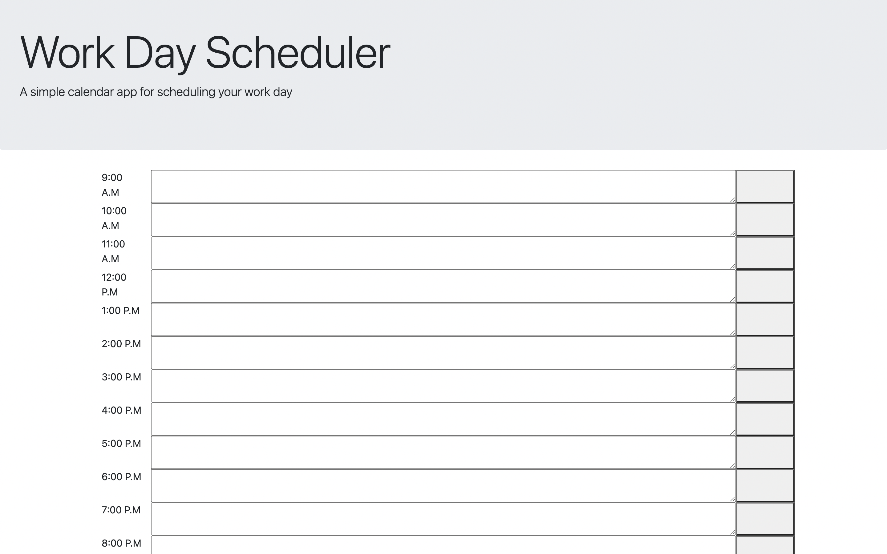

# challenge-5-
Daily Planner- Challenge-5
---
### Table of Contents
- [Description](#description)
- [Introduction](#introduction)
- [Challenges](#challenges)
- [Victories](#victories)
- [Resources](#resources)

---

## Description

Challenge #5- Daily Planner 

## Introduction 
This week we were challenged to create a Daily planner! I am a little late to turning in this challenge! I have been out of town!

---

## Challenges

Luckily we were given some starter code this week to start off the challnege! That made this application a little easier to build! 

---

## Victories
This challenge was fun to do! I felt a little more confident this challenge! 

---

---

## Resources 

<a href="https://github.com/torigonzales/challenge-5">GitHub Repo</a>

<a href="https://www.youtube.com/watch?v=eVGEea7adDM"> YouTube</a>

<a href="https://www.google.com/webhp?hl=en&sa=X&ved=0ahUKEwiLjJ7fosLvAhWXW80KHawRD_oQPAgI">Google</a>

<a href="https://www.w3schools.com/charsets/ref_html_ascii.asp">w3 Schools</a>

